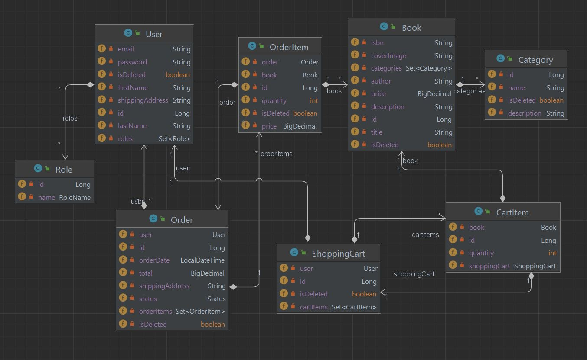

# Online Book Store

## Introduction

Welcome to Shopping Cart Management System, a web application designed to simplify online shopping by offering powerful cart management features. This project demonstrates my expertise in backend development with Spring Boot, Spring Security, and database technologies, focusing on scalability and secure user interactions.

## Features

- Add and Remove Items: Users can effortlessly add or remove items from their shopping cart.

- Secure Authentication: Role-based access control with Spring Security to ensure data privacy and secure user operations.

- API Documentation: Interactive Swagger UI for seamless API exploration and testing.

- Persistence: Implements Spring Data JPA with MySQL for reliable and efficient data storage.

- Exception Handling: Graceful handling of invalid operations and errors with informative responses.

- Postman Collection: Preconfigured API requests for easier manual testing and exploration.

## Technologies Used

**The application employs the following technologies and tools:**

- Spring Boot (3.4.1): Framework for developing the backend application.

- Spring Security (6.4.2): Provides authentication and role-based access control (part of Spring Boot Starter Security).

- Spring Data JPA (3.4.1): Manages database operations (included in Spring Boot Starter Data JPA).

- Swagger/OpenAPI (2.8.4): Enables REST API documentation and interactive testing.

- JUnit (5.8.2): Supports unit testing and integration testing.

- Mockito (5.14.2): Mocking framework (compatible with JUnit).

- MapStruct (1.6.3): Generates mapping code for DTOs and entities.

- Lombok (1.18.36): Simplifies code by auto-generating boilerplate code such as getters and setters.

- Docker (v28.0.1): Containerization platform used for deploying and managing the application in isolated environments.

- Spring Data JPA: Facilitates database operations with  MySQL.

- Liquibase (4.29.2): Handles database migrations and schema management (includes plugins for Maven).

- MySQL Connector (8.2.0): Establishes connections between the Java application and the MySQL database.

- Jacoco (0.8.12): Monitors and reports test coverage metrics.

- Postman: Provides tools to test and explore API functionalities manually.

## Architecture Overview

**This application follows a modular design to promote scalability and maintainability:**

- Controllers: Handle HTTP requests and delegate business logic.

- Services: Business logic and integration with the repository layer.

- Repositories: Interact with the database using Spring Data JPA.

- Entities: Represent the data structure stored in the database.

- Database Schema:

The schema includes tables for `users`, `roles`, `shopping_carts`, `items`, and `users_roles`. Each table ensures efficient management of user actions, item storage, and shopping cart operations.

## Brief description of application controllers

1. ### User Management (/auth)
   This controller handles user authentication and registration processes:

- `POST /auth/registration`: Register a new user.

- `POST /auth/login`: Log in an authenticated user and retrieve a token.

2. ### Shopping Cart Management (/cart)
   This controller manages user shopping carts:

- `GET /cart`: Retrieve the shopping cart of the authenticated user.

- `POST /cart`: Add a book to the user's shopping cart.

- `PUT /cart/items/{cartItemId}`: Update the quantity of a specific book in the shopping cart.

- `DELETE /cart/items/{cartItemId}`: Remove a book from the shopping cart.

3. ### Book Management (/books)
   Manages the operations related to books:

- `GET /books`: Retrieve a list of all books.

- `GET /books/{id}`: Retrieve details of a specific book by its ID.

- `POST /books`: Add a new book (Admin only).

- `PUT /books/{id}`: Update an existing book's details (Admin only).

- `DELETE /books/{id}`: Delete a book by its ID (Admin only).

- `GET /books/search`: Search for books by title, author, or other parameters.

4. ### Category Management (/categories)
   Handles operations related to categories:

- `POST /categories`: Create a new category (Admin only).

- `GET /categories`: Retrieve a list of all categories.

- `GET /categories/{id}`: Get details of a specific category by its ID.

- `PUT /categories/{id}`: Update a category's details (Admin only).

- `DELETE /categories/{id}`: Remove a category by its ID (Admin only).

- `GET /categories/{id}/books`: Retrieve books belonging to a specific category.

5. ### Order Management (/orders)
   This controller handles order-related processes:

- `GET /orders`: View the authenticated user's order history.

- `POST /orders`: Create a new order for the user.

- `PATCH /orders/{id}`: Update the status of an order (Admin only).

- `GET /orders/{orderId}/items`: View items in a specific order.

- `GET /orders/{orderId}/items/{itemId}`: View details of a specific order item.

### Postman Documentation
For detailed API testing instructions, visit the [Postman Collection](https://web.postman.co/documentation/41098914-81c1169f-bd95-486a-8953-b2802acceeb5).

## Model Diagram
Below is the **model diagram**, which illustrates the structure of entities and their relationships in the application:



---

## How to Launch the Project with Docker

1. Clone the Repository:

- Clone the project to your local machine:

`git clone` [repository](https://github.com/GarikSlavsky/online-book-store)

- Navigate to the project directory:

`cd online-book-store`

2. Set Up Environment Variables:

- Create a .env file in the root directory with the following content:

```
MYSQLDB_ROOT_PASSWORD=password
MYSQLDB_DATABASE=test
MYSQLDB_LOCAL_PORT=3307
MYSQLDB_DOCKER_PORT=3306
MYSQLDB_USER=root
MYSQLDB_PASSWORD=password

SPRING_LOCAL_PORT=8088
SPRING_DOCKER_PORT=8080
DEBUG_PORT=5005
```
Make sure this file is kept secure and not shared publicly.

3. Build and Start the Containers:

```
docker-compose build
docker-compose up
```

- This will:

Start the MySQL container with your configured settings.

Build and run the online-book-store application.

Ensure the app waits until the database is ready (health checks).

4. Access the Application:

- Once the containers are running, the application will be accessible at: [lonk](http://localhost:8088).

- Swagger UI: Navigate to [swagger](http://localhost:8088/swagger-ui/index.html#/) to explore the APIs.

- API Endpoints: Use Postman or cURL to interact with endpoints, e.g., `/cart`.

5. Stop and Clean Up:

To stop and remove the containers, networks, and volumes: `docker-compose down`.

## Challenges & Learnings

During the development of this project, I faced challenges such as:

1. Managing Recursive Relationships: Implementing the recursive structure for `shopping_carts` and `items` while maintaining database integrity.

- ***Solution***: Used proper join mappings and database constraints with JPA annotations.

2. Error Handling: Ensuring robust exception handling for invalid requests.

- ***Solution***: Leveraged `@ControllerAdvice` to return user-friendly error messages.

3. Security Configuration: Configuring Spring Security for role-based access and protecting sensitive endpoints.

- ***Solution***: Applied `@PreAuthorize` annotations and configured security filters.

These challenges enhanced my understanding of backend development and problem-solving in real-world scenarios.

## Demo Video

[Watch the Loom demo](https://www.loom.com/share/3dc3335c32094cdaab03587ca17a4246?sid=f8418463-1748-4689-91d6-a92bd9430894) to see the application in action.

## Contributing

Contributions are welcome! Feel free to fork this repository, submit issues, or create pull requests to enhance this project further.
